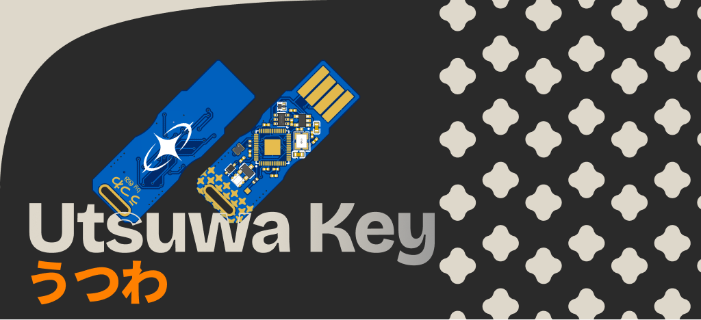

# Utsuwa (うつわ)



**Utsuwa** is a custom-engineered, open-source hardware security key based on the [**Pico Fido**](https://github.com/polhenarejos/pico-fido) firmware. It combines modern FIDO2/WebAuthn security.

Unlike standard keys that use mechanical buttons, **Utsuwa** uses a **Hall Effect Sensor**, allowing for contactless authentication via a magnetic ring or charm.

> Utsuwa (うつわ) comes from the Japanese word for "vessel", symbolizing a container for your digital soul.

---

## Features

* **Core:** Powered by the **Raspberry Pi RP2354A** (Dual Core RISC-V/ARM, Secure Boot, Internal Flash).
* **Auth:** **Contactless Magnetic Trigger** (AH3377 Hall Effect Sensor). Zero moving parts.
* **Visual:** **NeoPixel Glow** (WS2812C-2020) for internal status illumination.
* **Portable:** Ultra-compact USB-A form factor with integrated PCB plug, and space for a keychain attachment.
* **Robust:** ESD protection on USB lines for enhanced durability.

---

## Bill of Materials

**Total estimated cost:** €26.90

| Component | Part / Model | Qty | Notes |
| :--- | :--- | :--- | :--- |
| **Microcontroller** | Raspberry Pi RP2354A | 1 | Dual-core RISC-V/ARM with Secure Boot |
| **Hall Effect Sensor** | AH3377-W-7 | 1 | Contactless magnetic authentication trigger |
| **RGB LED** | WS2812C-2020 | 1 | Status indicator NeoPixel |
| **Crystal Oscillator** | ABM8-272-T3 (12 MHz) | 1 | External clock reference |
| **Voltage Regulator** | AP2112K-3.3TRG1 | 1 | 3.3V LDO power supply |
| **USB Protection** | USBLC6-2SC6 | 1 | ESD protection on USB lines |
| **Inductor** | 3.3µH (AOTA-B201610S3R3) | 1 | Buck converter filtering |
| **Diode** | 1N4148WS | 1 | Schottky diode for power path |
| **Capacitors** | 100nF, 4.7µF, 10µF, 18pF | 13 | Decoupling and filtering |
| **Resistors** | 27Ω, 33Ω, 1kΩ | 4 | USB termination and pull-ups |
| **PCB Fabrication** | Custom USB-A form factor | 1 | Compact design with integrated plug |

Complete CSV with supplier links: [`bom.csv`](bom.csv)

---

## Firmware

This board runs on the [Pico Fido](https://github.com/polhenarejos/pico-fido) open-source firmware. To support the custom hardware (RP2354A + Hall Effect + WS2812), you must compile the firmware with the following settings in `board_config.h`:

```c
// Flash Size for RP2354A (Internal 2MB)
#define PICO_FLASH_SIZE_BYTES (2 * 1024 * 1024)

// Authentication Button (Hall Effect Sensor)
// Hall Effect pulls Low when magnet is present
#define BUTTON_PIN 18
#define BUTTON_PULL UP 

// Status LED (WS2812C-2020)
#define HAVE_WS2812
#define WS2812_PIN 19
#define WS2812_POWER_PIN -1 // Directly powered by VBUS
```

## Flashing Instructions

    First Time: Short the BOOT pad with the lanyard loop copper on the front of the PCB with tweezers or some other conductive material while plugging it in.

    Mount: The device will appear as a USB Mass Storage Drive (RPI-RP2).

    Flash: Drag and drop your compiled .uf2 file.

    Reboot: The device will reboot as a FIDO2 Security Key.

## Acknowledgments

Designed with 💙 by 𝕲𝕭

Special thanks to the Hack Club community for their support